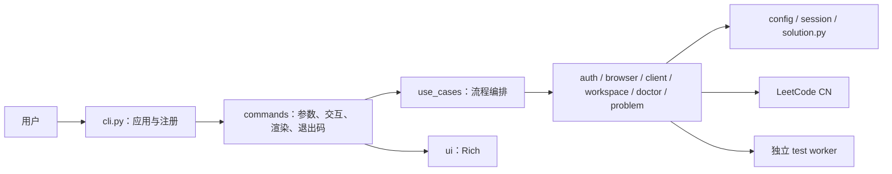

# 当前架构

项目是同步 Python CLI。Typer 和 Rich 只属于终端适配层；应用用例复用明确的路径、认证、HTTP、工作区和本地 worker 能力。



## 运行上下文

```text
用户配置目录/
└── config.toml                 # 默认工作区、站点

用户状态目录/
└── session.json                # 当前系统用户的明文 Session

默认工作区/
├── .leetcode_local_cli/
│   └── workspace.toml         # 本机工作区版本、站点、语言
└── solution.py                # 当前解题文件
```

`UserPaths` 表示用户配置和 Session，`WorkspacePaths` 表示 marker 和 `solution.py`；只有同时需要两类资源的流程才组合为 `AppPaths`。`login`、`status`、`profile`、`show`、`get` 和 `check` 只解析 `UserPaths`；默认 `doctor` 从 `UserPaths` 启动并按现状诊断可选工作区，因此这些命令都不要求已有工作区。`solve`、`test`、`submit` 和 `doctor --run-solution` 必须验证 `WorkspacePaths`。当前目录不决定业务文件位置。

## 模块职责

| 模块 | 职责 |
| --- | --- |
| `cli.py` | 创建 Typer 应用、全局回调和命令注册 |
| `commands/` | CLI 参数、交互、Rich 渲染和退出码映射 |
| `use_cases/` | 登录、账号、题目、诊断、本地测试和提交编排 |
| `paths.py` / `config.py` | 跨平台路径、`UserPaths` / `WorkspacePaths` / `AppPaths`、配置与工作区初始化 |
| `safe_files.py` / `solution_source.py` | 安全目标、原子写入和 UTF-8 读取边界 |
| `browser.py` / `auth.py` | 浏览器授权、Cookie 获取、验证与 Session |
| `client.py` / `problem.py` / `submission.py` | LeetCode CN HTTP、题目模型和结构化提交结果 |
| `workspace.py` / `local_testing.py` / `_test_runner.py` | 解法模板、参数协议和独立 worker |
| `doctor.py` | 本地、Session 和远端诊断模型 |
| `ui.py` | 外部文本净化与 Rich 展示 |

## 核心数据流

- **初始化**：命令解析目标 → 创建本机 `workspace.toml` marker 和缺失的 `solution.py` → 原子写入用户配置。重复初始化保留已有普通解法。
- **登录**：Chrome → Edge → 手动 Cookie；浏览器授权只读取目标站点 Cookie，在线验证成功后才把 Session 保存到用户状态目录，不依赖工作区。
- **解题**：题号 → 在线题目模型 → 模板与 marker → 安全覆盖普通 `solution.py`。
- **本地调用**：严格读取源码 → 启动 worker → 安全解析参数 → 每组新建 `Solution` 并限时调用 → Rich 或 JSON Lines 输出。
- **提交**：读取 marker → 发送 Python3 代码 → 获得 submission ID → 在单调时钟总预算内查询判题 → 返回终态、超时或轮询失败模型。初始 POST 不重试，安全的 GET 只做有限重试；`lc check` 则只查询一次已有 ID 并返回终态、仍在判题或查询失败。CLI 负责展示和退出码，不自动运行本地测试。

## 依赖约束

- 依赖只能从 `cli` 向 `commands`、`use_cases` 和底层模块流动，底层不得反向导入上层。
- `use_cases/` 不依赖 Typer、Rich、`ui.py` 或具体终端；需要输出时接收窄回调。
- 路径由按生命周期拆分的运行上下文提供，不在导入时捕获 `Path.cwd()`。
- 安装目录、用户配置、工作区和凭据属于不同生命周期。
- 当前保持同步、中文站、Python3、单工作区和单解题文件，不因未来目标提前引入框架。
