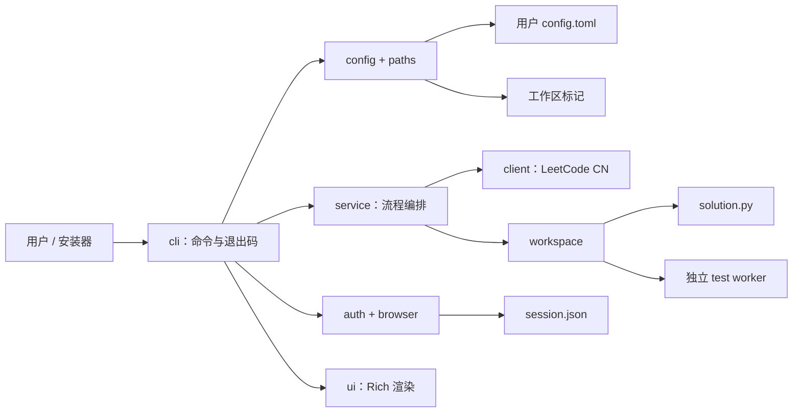

# 当前架构

最近更新：2026-08-01

本文只描述 `v0.9.0` 已存在的结构。未来方向见 [PROJECT_DESIGN](PROJECT_DESIGN.md)。

## 总览

项目是同步 Python CLI。Typer 负责入口，Rich 负责展示；业务命令先解析默认工作区为不可变 `AppPaths`，再把明确路径传入认证、题目、文件、测试和提交链路。工具安装目录与用户数据位置无关。



## 目录与运行上下文

```text
用户配置目录/
└── config.toml                 # 默认工作区、站点

默认工作区/
├── .leetcode-local-cli.toml   # 工作区版本、站点、语言
├── solution.py                # 当前唯一解题文件
└── .leetcode_local_cli/
    └── session.json           # 当前阶段的明文 Session
```

普通命令执行：

```text
CLI → resolve_app_paths() → 验证用户配置和工作区标记
    → AppPaths → 显式传递 session_file / solution_file
```

`--help`、`--version` 和 `init` 不要求已有工作区。当前目录不决定业务文件位置。

## 模块职责

| 模块 | 职责 | 关键边界 |
| --- | --- | --- |
| `cli.py` | 命令、参数、交互、错误文案和退出码 | 不应承载核心规则 |
| `paths.py` / `config.py` | 跨平台配置位置、`AppPaths`、TOML 和初始化 | 配置损坏时拒绝覆盖 |
| `safe_files.py` | 普通目标校验、排他创建和原子替换 | 不理解业务；拒绝链接/reparse |
| `browser.py` | Chrome/Edge 发现、授权等待和身份检查 | 不读取 Cookie、不关闭日常浏览器 |
| `auth.py` | DevTools/手动 Cookie、在线验证和 Session | 只连接受限回环端点；不输出秘密 |
| `client.py` | LeetCode CN HTTP、GraphQL、提交和判题 | 同步 httpx；当前固定 Python3 |
| `problem.py` | 题号解析和题目模型 | 基本无 IO |
| `workspace.py` | 模板、写入、静态检查、worker 生命周期和 marker | 路径必须显式传入 |
| `solution_source.py` | UTF-8/UTF-8 BOM 读取边界 | 不猜测或改写编码 |
| `local_testing.py` | 安全参数解析和 JSON 行协议 | 不执行用户输入 |
| `_test_runner.py` | 加载 `Solution`、发现入口、逐组调用 | 独立进程，不是安全沙箱 |
| `doctor.py` | Session、工作区和远端诊断结果 | 默认不执行用户代码 |
| `service.py` | 账号、题目、诊断和提交编排 | 仍耦合 Typer/Rich，待迁移 |
| `ui.py` | 外部文本净化和 Rich 展示 | 不决定业务成功与否 |

## 核心数据流

### 初始化与写入

`lc init` 验证已有配置和目标，创建缺失文件但保留已有普通 `solution.py`，最后原子写入用户配置；失败只清理本次创建内容。`lc solve` 是明确的切题操作，可以原子覆盖普通 `solution.py`。两条链路都拒绝符号链接、断链、目录、junction 和 reparse point。

### 登录

默认顺序为 Chrome → Edge → 手动 Cookie。浏览器路径读取默认用户目录中的 `DevToolsActivePort`，必要时打开一个可见窗口等待用户授权，在 180 秒总预算内处理启动竞态。连接必须是身份匹配的本机回环端点；仅请求 `https://leetcode.cn/` 的 `LEETCODE_SESSION` 和 `csrftoken`，在线验证成功后才原子保存。CLI 不读取 Cookie 数据库，也不拥有或关闭日常浏览器。

### 本地调用

`lc test` 先按严格 UTF-8 边界读取文件，再启动持久 worker。worker 按定义顺序选择 `Solution` 第一个公开实例方法；CLI 将 `name = value` 限制为安全 Python 字面量并用 JSON 行协议传输。每组创建新 `Solution`，默认限时 1 秒；超时终止 worker，下一组重启。交互模式使用 Rich，`--stdin` 输出 JSON Lines。

### 提交

提交只读取 `solution.py` 的 marker 区域，不运行本地测试。客户端发送代码并轮询判题；UI 先展示结果，CLI 再映射退出码。只有明确 `Accepted` 为 0。当前轮询仍是固定次数，尚未形成稳定总超时。

## 依赖方向

```text
cli → config/paths, browser/auth, service, workspace, ui
service → auth, client, doctor, problem, workspace, ui
browser/auth/workspace/config → safe_files 或明确的底层原语
workspace → local_testing, solution_source, _test_runner 子进程
client → httpx
ui → Rich
```

`paths`、`safe_files` 和核心数据处理不得反向依赖 CLI/UI。核心层最终也应移除 `service.py` 中现存的 Typer/Rich 依赖。

## 架构约束

- 路径由运行上下文提供；不得在导入时捕获 `Path.cwd()`。
- 安装、用户配置、工作区和凭据是不同生命周期的资源。
- 初始化幂等且非破坏；覆盖行为必须由明确业务命令触发。
- 外部文本、配置、文件目标、浏览器端点和网络响应都不可信。
- 文件写入使用同目录随机临时文件与原子替换。
- 用户代码只在显式测试或 Doctor 执行模式运行；当前隔离不是沙箱。
- Cookie 不进入日志、异常、fixture、报告或版本控制。
- 当前保持中文站、Python3、单工作区、单解题文件和同步实现。

## 主要技术债

- `service.py` 仍通过 `typer.Exit` 和 UI 函数表达业务错误。
- 账号与提交等成功结果仍有裸字典。
- Session 仍是明文 JSON。
- 稳定 Python API 与站点适配器尚不存在。
