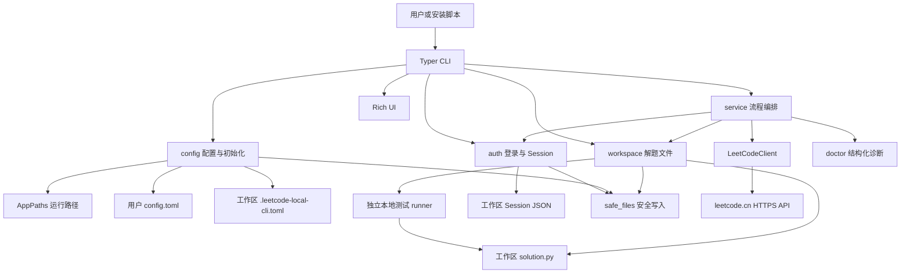

# 当前架构

最近更新：2026-07-31

本文描述 `v0.8.0` 发布后当前源码的真实架构。长期 API、双站点和 UI 方向见 [PROJECT_DESIGN](PROJECT_DESIGN.md)，未实现内容不得视为当前能力。

## 整体架构

程序仍是同步 Python CLI，但路径解析已经从业务模块中抽离。Typer 命令在执行具体业务前读取用户配置，构造一个不可变 `AppPaths`，再把明确的 Session 和 `solution.py` 路径传给认证、service、Doctor 与工作区模块。



工具安装目录不参与用户文件定位。通过 uv、wheel、源码或模块入口启动时，普通命令都读取同一份默认工作区配置。

## 模块职责

| 模块 | 当前职责 | 边界 |
| --- | --- | --- |
| `paths.py` | 跨平台用户配置目录、工作区文件名和不可变 `AppPaths` | 只依赖标准库，不导入 CLI、auth 或 workspace |
| `config.py` | 版本化 TOML 解析、默认工作区解析、非破坏初始化 | 不负责交互文案；配置损坏时拒绝覆盖 |
| `safe_files.py` | 普通目标校验、链接/reparse 拒绝、排他创建、随机临时文件和原子替换 | 不理解 LeetCode 业务，只提供文件系统安全原语 |
| `solution_source.py` | 统一读取 UTF-8/UTF-8 BOM 的 `solution.py`，把解码失败转换为专用异常 | 不猜测编码、不替换非法字节、不修改用户文件 |
| `cli.py` | 命令、参数、交互确认、路径解析、错误和退出码映射 | `--help`、`--version` 不解析工作区；业务命令需要有效默认工作区 |
| `auth.py` | Chrome/手动 Cookie、Session 保存读取与静态检查 | Session 路径必须由调用者传入；当前只支持 `leetcode.cn` |
| `workspace.py` | 模板、原子写入、打开、执行、静态检查和提交 marker 解析 | 所有公开工作区操作必须接收明确文件路径 |
| `_test_runner.py` | 在独立子进程中解析、加载并调用一次用户的 `run_cases()` | 仅接受同步无参数入口；以内部退出码区分缺失、未配置和执行失败 |
| `service.py` | 账号、题目、Doctor 和提交流程编排 | 仍直接依赖 Typer 与 UI，是 v0.9 后需要继续解耦的过渡层 |
| `doctor.py` | 把 Session、工作区和远端状态转成结构化检查结果 | 默认不执行用户代码 |
| `client.py` | 中文站 HTTP、GraphQL、提交和判题查询 | 同步 httpx、固定 Python3 |
| `problem.py` | 题号解析与题目模型标准化 | 基本是无 IO 的纯逻辑 |
| `ui.py` | 外部文本安全过滤和 Rich 展示 | 不决定业务规则 |

## 配置与目录

Windows 示例：

```text
C:/Users/<user>/AppData/Roaming/leetcode-local-cli/
└── config.toml

D:/Projects/leetcode-local-cli/
├── .leetcode-local-cli.toml
├── solution.py
└── .leetcode_local_cli/
    └── session.json
```

用户配置只保存非秘密字段：

```toml
version = 1
default_workspace = "D:/Projects/leetcode-local-cli"
default_site = "cn"
```

工作区配置只保存当前版本、站点和语言：

```toml
version = 1
site = "cn"
language = "python3"
```

Cookie 仍只存在 Session JSON。这个 v0.8 阶段性决定服务于维护者授权的真实验收，不代表长期安全架构。

## 核心数据流

### 初始化

1. `lc init` 先读取现有用户配置；损坏时立即停止，不覆盖。
2. 无显式路径且已有有效默认工作区时，直接返回复用结果。
3. 无路径时交互读取父目录并追加 `leetcode-local-cli`；显式路径按完整工作区处理。
4. `config.initialize_workspace()` 验证工作区、标记文件和 `solution.py` 均不是链接、目录或 reparse point。
5. 缺少的工作区配置和空 `solution.py` 被创建；已有普通文件保持不变。
6. 最后原子写入用户配置。失败时只清理本次创建的工作区文件，不删除预先存在内容。

### 普通命令

```text
CLI 命令
→ resolve_app_paths()
→ 用户 config.toml
→ 工作区标记验证
→ AppPaths
→ 将 session_file / solution_file 显式传给用例
```

因此当前终端目录不再决定业务文件位置。没有有效配置时，命令以非零状态提示执行 `lc init`。

### 登录

`lc login` 解析默认工作区后读取浏览器或手动 Cookie，在线验证成功才把 Session 原子写入 `AppPaths.session_file`。保存使用私有目录权限（POSIX `0700`）和文件权限（POSIX `0600`），同时拒绝链接和 reparse 目标。

### 题目生成与写入

`lc solve` 获取题目后，把内容交给 `workspace.write_solution_file(paths.solution_file, ...)`。写入先验证目标，然后在同目录创建不可预测的排他临时文件，完整写入并 `fsync`，再次验证目标后使用 `os.replace` 原子替换。旧文件在写入失败时保持不变。

### 测试、Doctor 与提交

- `solution_source.read_solution_source()` 是三条链路共享的解码边界；非 UTF-8 在任何编译、执行或提交解析之前转换为 `INVALID_ENCODING` 或 `WorkspaceError`。
- `lc test` 先静态检查明确的 `solution.py`，再由 `workspace.run_local_tests()` 启动 `_test_runner` 子进程。
- runner 先用 AST 判断顶层 `run_cases()` 是否存在、是否为受支持的同步入口，以及是否仍为空实现；缺失入口不会为了检查而执行文件顶层代码。
- 有效入口使用静态检查时的同一份已解码源码快照，以非 `__main__` 名称执行，避免二次读取差异和模板 main guard 重复调用；随后显式调用一次 `run_cases()`。
- 子进程 stdout、stderr 和内部退出码映射为不可变 `LocalTestResult`。CLI 安全显示外部文本，并把未配置、失败和默认 1 秒超时统一映射为退出码 1。
- Doctor 使用同一 Session/solution 路径，默认只静态检查。
- 提交只读取明确路径中的 marker 区域并使用同工作区 Session，不检查或执行 `run_cases()`。
- 提交结果先由 UI 展示，再由 CLI 映射退出码：仅 `status_msg == "Accepted"` 返回 0；其他终态、缺失终态和轮询超时返回 1。

## 模块依赖关系

```text
__main__ -> cli
cli -> config, paths, auth, service, ui, workspace
config -> paths, safe_files, tomllib
service -> paths, auth, client, doctor, problem, ui, workspace, typer
doctor -> auth, client result types, workspace
auth -> browser_cookie3, safe_files
workspace -> safe_files, _test_runner constants, subprocess, platform file opener
workspace -> solution_source
_test_runner -> solution_source, Python standard library
solution_source -> Python standard library
client -> httpx
ui -> rich, doctor result types
problem -> Python standard library
paths -> Python standard library
safe_files -> Python standard library
```

禁止 `paths` 或 `safe_files` 反向导入 CLI 和业务模块。

## 设计原则

1. 路径由运行上下文提供，不从导入时当前目录推断。
2. 安装位置、用户配置、工作区和凭据是不同生命周期的资源。
3. 初始化幂等且非破坏；业务切题命令才允许覆盖普通解题文件。
4. 外部配置和文件系统目标是不可信输入，损坏或不支持时拒绝猜测。
5. 文件写入使用随机同目录临时文件和原子替换，链接与 reparse point 不可作为目标。
6. 核心路径、配置和文件原语不依赖 Typer/Rich。
7. Cookie 不得进入输出、异常、测试 fixture、提交或发布产物。
8. 当前保持单文件、中文站、Python3 和同步实现，不借 v0.8 扩大产品范围。
9. 本地自测是用户主动选择的代码执行；入口校验、一次调用、总超时和受控错误必须由 CLI 保证，远程提交不依赖本地自测。
10. 用户解题文件只按 UTF-8/UTF-8 BOM 解码；编码不确定时拒绝，不通过猜测、替换或自动改写掩盖错误。
11. 终端文案与机器退出码必须表达同一业务结果；显示错误不能同时返回成功状态。

## 仍需演进的边界

- service 仍通过 `typer.Exit` 和 UI 函数控制错误与展示。
- Session 仍是工作区明文 JSON，系统秘密存储延后。
- Python API、双站点适配器和稳定异常模型尚未实现。
- 单文件工作区是当前阶段决定，v0.14 API 冻结前仍需评估长期模型。
