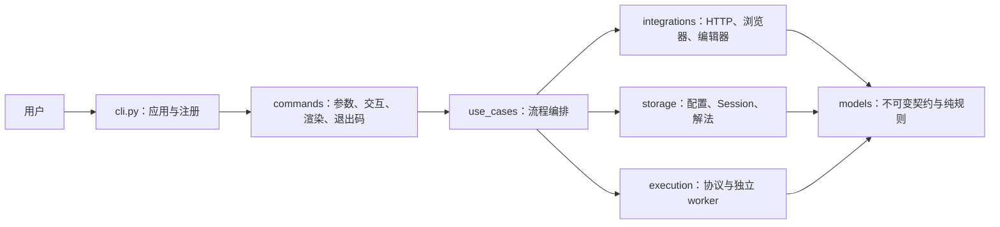

# 当前架构

项目是同步 Python CLI。按职责与资源生命周期分层：终端适配不决定业务规则，用例编排流程，底层组件管理具体资源，模型承载稳定契约。内测重构不保留旧根模块的兼容转发。



## 源码目录

```text
src/leetcode_local_cli/
|-- cli.py, __main__.py, __init__.py, version.py
|-- commands/                 # 参数、隐藏输入、输出、退出码
|   `-- rendering.py          # Rich 和不可信文本净化
|-- use_cases/                # 登录、账号、题目、提交、初始化等流程
|   |-- errors.py             # 稳定业务错误码
|   `-- doctor_checks.py      # 诊断规则，不作为普通命令的依赖
|-- models/                   # account / problem / session / result 等模型
|-- storage/
|   |-- paths.py, config.py   # 路径及配置读写格式
|   |-- safe_files.py         # 安全目标与原子文件操作
|   |-- session.py            # Session 单次读取、校验、保存
|   `-- solution.py, solution_source.py
|-- integrations/
|   |-- leetcode.py, problem_parser.py
|   |-- browser.py, devtools.py
|   `-- editor.py             # 系统文件打开请求
`-- execution/
    |-- protocol.py           # 受限参数与 JSON 协议
    |-- worker.py             # 父进程控制
    `-- runner.py             # 子进程入口
```

## 运行上下文

```text
用户配置目录/
└── config.toml                 # 默认工作区、站点

用户状态目录/
└── session.json                # 当前系统用户的明文 Session

默认工作区/
├── .leetcode_local_cli/
│   └── workspace.toml         # 本机工作区版本、站点、语言
└── solution.py                # 当前解题文件
```

`UserPaths` 表示用户配置和 Session，`WorkspacePaths` 表示 marker 和 `solution.py`；只有同时需要两类资源的流程才组合为 `AppPaths`。`login`、`status`、`profile`、`show`、`get` 和 `check` 只解析 `UserPaths`；默认 `doctor` 从 `UserPaths` 启动并按现状诊断可选工作区，因此这些命令都不要求已有工作区。`solve`、`test`、`submit` 和 `doctor --run-solution` 必须验证 `WorkspacePaths`。当前目录不决定业务文件位置。

## 模块职责

| 模块 | 职责 |
| --- | --- |
| `cli.py` | 创建 Typer 应用、全局回调和命令注册 |
| `commands/` | CLI 参数、交互、Rich 渲染和退出码映射 |
| `use_cases/` | 登录、账号、题目、诊断、本地测试和提交编排 |
| `models/` | 冻结的账号、题目、Session、执行和提交结果；不依赖 I/O 与终端 |
| `storage/` | 文件与路径机制；不启动编辑器、worker 或 HTTP 请求 |
| `integrations/` | 外部系统边界；HTTP 响应在此转换为类型化结果 |
| `execution/` | 可信用户代码的参数协议、进程控制和执行 |

## 核心数据流

- **初始化**：命令解析目标 → 用例检查原始配置和文件目标 → 创建 marker 与缺失解法 → 原子写入用户配置。`--repair` 仅恢复损坏配置，先生成同目录原字节备份；失败回滚本次文件变化并保留备份。重复初始化保留已有普通解法。
- **登录**：Chrome → Edge → 手动 Cookie；浏览器授权只读取目标站点 Cookie，在线验证成功后才把 Session 保存到用户状态目录，不依赖工作区。
- **账号**：Session 单次读取并校验 → `UserStatus` → 已登录才请求 `ProblemStats` → 用例组装 `AccountProfile`。Doctor 使用同一个 Session 读取结果生成报告和构造客户端。
- **解题**：题号 → 在线 `ProblemPage` / `ProblemDetail` → 安全覆盖普通 `solution.py` → 按选项请求打开文件。存储不负责打开；打开失败只形成 `SolveResult.open_warning`，不撤销保存。
- **本地调用**：严格读取源码 → 启动 worker → 安全解析参数 → 每组新建 `Solution` 并限时调用 → Rich 或 JSON Lines 输出。
- **提交**：读取 marker → 发送 Python3 代码 → 获得 submission ID → 在单调时钟总预算内查询判题 → 返回终态、超时或轮询失败模型。初始 POST 不重试，安全的 GET 只做有限重试；`lc check` 则只查询一次已有 ID 并返回终态、仍在判题或查询失败。CLI 负责展示和退出码，不自动运行本地测试。

## 依赖约束

- `models` 只依赖标准库和同层模型；`storage` 只依赖标准库、同层和模型。
- `integrations` 与 `execution` 可使用 `storage` 的路径/读取能力，但不互相依赖，也不反向导入用例或命令。
- `use_cases/` 不依赖 Typer、Rich 或具体终端；需要输出时接收窄回调。命令可使用路径、模型及执行协议等终端适配所需的窄接口。
- 传输层裸 JSON 只在集成内部解析；稳定成功返回 `ClientSuccess[T]`，失败返回 `ClientFailure`。用例使用 `UseCaseError.code` 表达错误分类，CLI 决定中文显示和退出码。
- `tests/test_architecture.py` 用 AST 检查依赖方向、旧根模块清除、普通用例与诊断解耦及 cwd 约束。
- 路径由按生命周期拆分的运行上下文提供，不在导入时捕获 `Path.cwd()`。
- 安装目录、用户配置、工作区和凭据属于不同生命周期。
- 当前保持同步、中文站、Python3、单工作区和单解题文件，不因未来目标提前引入框架。
