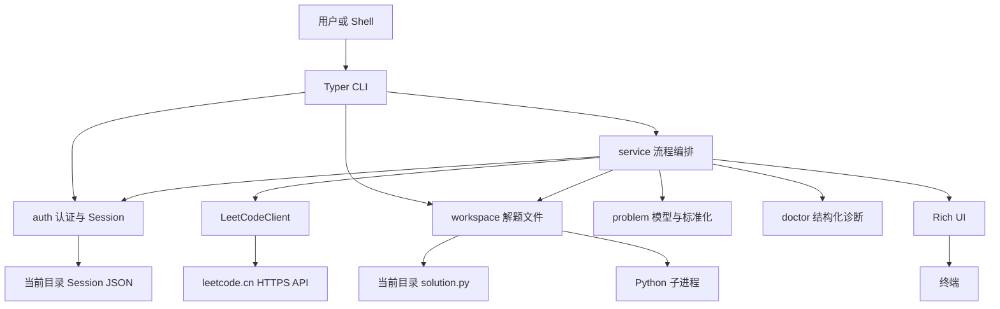
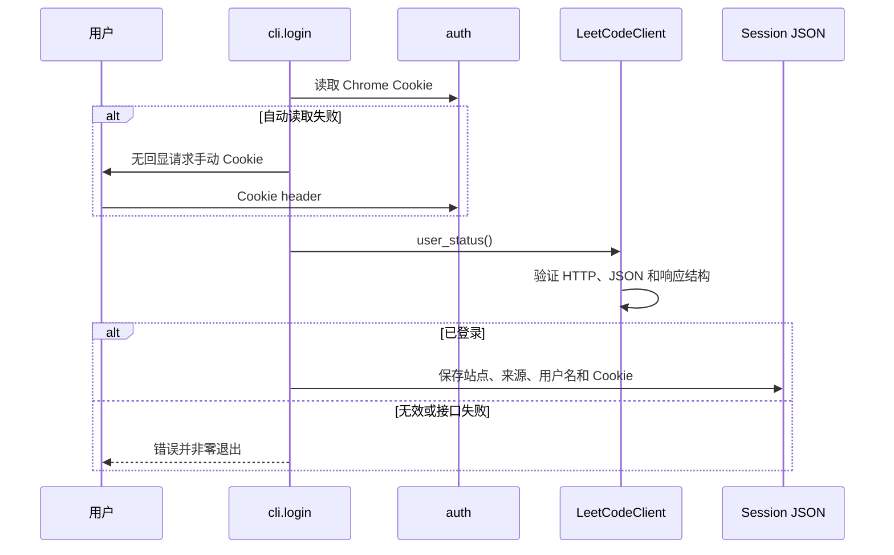

# 当前架构

最近更新：2026-07-28

本文描述 `v0.7.2` 源码的真实架构，并单独标明尚未实现的目标方向。它不是对 [v1.0 总体设计大纲](PROJECT_DESIGN.md)的替代。

## 整体架构

当前程序是一个同步 Python CLI。Typer 负责命令入口，service 负责部分流程编排，认证、HTTP、题目标准化、工作区和诊断分布在独立模块中，Rich 负责终端展示。



这是“正在形成分层”的架构，而不是已经完全解耦的分层架构。CLI 仍直接调用认证、客户端和工作区，service 仍直接控制终端错误输出和 Typer 退出。

## 模块职责

### 入口与界面

| 模块 | 当前职责 | 当前边界 |
| --- | --- | --- |
| `__main__.py` | 支持 `python -m leetcode_local_cli` | 直接调用 `cli.run()` |
| `cli.py` | 注册命令、解析参数、设置 UTF-8 输出、决定退出码 | 部分命令直接操作 auth、client 和 workspace |
| `ui.py` | 使用 Rich 展示状态、表格、题面、Doctor 和判题结果 | 不应决定业务规则；外部字符串必须按纯文本处理 |
| `version.py` | 从已安装发行版元数据读取版本 | 找不到发行包时返回 `unknown` |

### 应用编排

| 模块 | 当前职责 | 当前边界 |
| --- | --- | --- |
| `service.py` | 加载 Cookie、查询账号和题目、组织 Doctor、提交并轮询结果 | 直接依赖 `typer.Exit`、Rich loading 和错误输出，尚不是独立应用层 |
| `doctor.py` | 把 Session、工作区和远端检查转换为结构化 `DoctorCheck`/`DoctorReport` | 默认只做静态检查；执行工作区代码必须显式启用 |

### 核心能力与基础设施

| 模块 | 当前职责 | 当前边界 |
| --- | --- | --- |
| `auth.py` | 读取 Chrome Cookie、解析手动 Cookie、保存/迁移/检查 Session | 只支持 `leetcode.cn`；默认路径在导入时由当前目录确定 |
| `client.py` | 封装中文站 HTTP、GraphQL、提交与判题查询 | 同步 `httpx.Client`；固定中文站和 Python3；使用 `ClientResult` 返回错误分类 |
| `problem.py` | 题号解析、题目摘要和详情模型、远端数据标准化 | 基本不依赖 CLI 或 IO，是当前最接近纯领域逻辑的模块 |
| `workspace.py` | 构建模板、校验并写入和打开 `solution.py`、运行子进程、解析提交 marker、静态检查 | 默认路径在导入时确定；已拒绝静态可识别的非普通写入目标，完整事务安全尚未完成 |

## 核心数据流

### 登录



Session 当前默认写到 CLI 启动目录的 `.leetcode_local_cli/session.json`。旧 `.aether_lc/session.json` 会在首次读取时尝试迁移。

### 题目查询与生成

1. CLI 通过 service 检查 Session 结构并加载必要 Cookie。
2. service 使用每页 100 条的题目列表，从 `skip=0` 开始扫描，直到找到展示题号或到达总数。
3. 找到 `titleSlug` 后请求题目详情。
4. `problem.py` 把远端字典标准化为 `ProblemDetail`，同时保留展示题号和内部提交 ID。
5. `lc get` 把详情交给 UI；`lc solve` 额外构建 `ProblemMetadata` 并调用 workspace。
6. workspace 生成模板，并使用不跟随链接的 `lstat()` 检查 `solution.py` 目录项：目标不存在时允许创建，普通文件允许覆盖，符号链接、断链、目录和 Windows reparse point 会在写入前被拒绝。
7. 写入成功后才尝试通过系统关联打开文件；校验或写入失败由 CLI 映射为清晰错误和非零退出码。

当前校验阻断了预先存在的非普通目标，但检查与直接打开写入之间仍存在时间窗口。随机临时文件、排他创建、原子替换和失败时保留旧文件属于 `PB-005` 尚待确认和实施的事务边界。

### 本地测试

1. `cli.test` 调用 `inspect_solution_file()` 检查存在性、可读性和 Python 语法。
2. 当前命令不会验证 `run_cases()` 是否存在或是否被调用。
3. workspace 以 `[sys.executable, solution.py]` 启动子进程，不使用 Shell。
4. `lc test` 当前没有超时，隐藏子进程 stdout、stderr 和 traceback，只根据退出码显示成功或失败。

Doctor 使用相同的检查逻辑，但只有 `--run-solution` 才执行文件，并设置 10 秒超时。

### 远程提交

1. workspace 读取 UTF-8 `solution.py`，解析四项元数据和 `submit_begin`/`submit_end` 区域。
2. service 显示提交目标，加载 Cookie，并调用中文站提交接口。
3. client 从 Cookie Jar 读取 `csrftoken`，发送固定语言为 `python3` 的提交请求。
4. service 最多轮询 10 次，每次间隔 0.5 秒；状态离开 `PENDING`/`STARTED` 后返回原始结果字典。
5. UI 渲染 Accepted 或失败信息。当前 CLI 没有把所有非 Accepted 和轮询超时统一转换为非零退出码。

### Doctor

1. `diagnose_session()` 静态检查 Session JSON，并只返回安全元数据和缺失 Cookie 名称。
2. `diagnose_solution()` 静态检查解题文件；可选执行。
3. service 进行一次 `user_status()` 请求，同时区分站点连通性和认证状态。
4. `DoctorReport.ok` 只在没有 `FAIL` 检查项时为真；`WARNING` 不会使整体失败。

## 模块依赖关系

当前主要依赖方向：

```text
__main__ -> cli
cli -> auth, client, service, ui, workspace, version
service -> auth, client, doctor, problem, ui, workspace, typer
doctor -> auth, client result types, workspace
client -> httpx
auth -> browser_cookie3, filesystem
workspace -> filesystem, subprocess, platform file opener
ui -> rich, doctor result types
problem -> Python standard library only
```

当前需要逐步修复的依赖问题：

- `service -> typer`：核心流程通过 `Exit` 控制界面退出，Python 调用者无法获得独立异常契约。
- `service -> ui`：流程编排同时决定文案和 loading 状态，业务结果难以被其他界面复用。
- `cli -> client/auth/workspace`：CLI 并非统一通过一个应用层入口，迁移时容易形成重复业务规则。
- `ui -> doctor`：当前只依赖结构化结果类型，风险较低；长期可把公共模型移到独立模型模块。
- `auth/workspace -> Path.cwd()`：模块导入产生路径状态，不利于多工作区、库 API 和可预测测试。

## 设计原则

以下原则来自当前安全边界和长期设计，后续实现应保持：

1. **核心不依赖界面**：网络、模型、认证和工作区逻辑最终不应导入 Typer 或 Rich。
2. **CLI 是核心能力的使用者**：同一业务操作只保留一套实现，CLI 和 Python API 不走两条逻辑。
3. **显式运行上下文**：路径由调用上下文或配置提供，不在导入时捕获当前目录。
4. **结构化结果和异常**：内部错误包含可判断的类型，中文文案和退出码由 CLI 映射。
5. **站点差异显式隔离**：未来双站点通过适配器表达，不在各模块散布域名判断。
6. **秘密与工作区分离**：Cookie 不属于项目文件，不应默认保存在普通工作目录。
7. **安全写入**：普通文件覆盖是当前产品行为，但链接、目录和 reparse point 必须拒绝；事务语义应明确。
8. **外部文本不可信**：站点、配置和工作区字符串不得被解释为 Rich markup、控制序列或隐式链接。
9. **同步优先**：当前吞吐需求不需要 async 双接口；超时和资源关闭仍必须明确。
10. **轻量产品边界**：当前不引入数据库、完整题库、后台同步、Web、AI 或多语言提交。
11. **测试分层**：纯逻辑单元测试、HTTP MockTransport、CLI 测试、打包测试、跨平台测试和显式手动真实验收各自承担不同风险。
12. **先确认行为再编码**：`PRODUCT_BOUNDARIES.md` 中的待定语义不能由历史实现或测试偶然冻结。

## 目标架构方向

长期目标不是一次性重写，而是把当前模块逐步迁移为：

```text
Typer CLI ---------> 应用用例层 <--------- Python API
                         |
          +--------------+--------------+
          |              |              |
       领域模型       客户端门面      工作区/认证服务
                          |
                  中文站/国际站适配器
                          |
                       HTTP 传输
```

该方向已写入设计草案，但 `api.py`、`models.py`、`errors.py`、双站点适配器和系统秘密存储目前都不存在，不应在当前状态中写成已完成能力。
