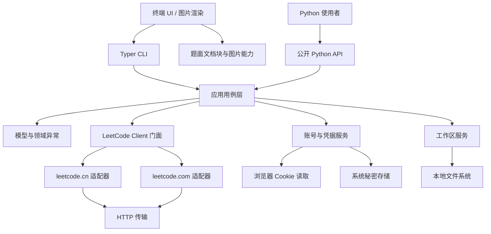

# LeetCode Local CLI：v1.0 总体设计大纲

状态：`Draft 0.2`，等待审查，不代表已批准实施。

适用范围：从当前 `v0.8.0` 演进到首个稳定版本 `v1.0`。本文只详细设计当前单一项目；数据库、全栈、AI 和双产品线属于 `v1.0` 之后的方向。

## 1. 文档目的

本项目当前已经具备登录、题目查询、单文件解题、本地测试、远程提交、Doctor、PyPI 发布和 uv 工具安装能力。下一阶段不应继续把功能直接堆入 CLI，而应先形成可复用的 Python 核心，再完成双站点、终端图片、UI 重构和发布前源码收口。

当前行为与待定语义统一记录在 [产品边界与待定决策](PRODUCT_BOUNDARIES.md)。本文负责长期架构，不重复替尚未拍板的行为选择结论。

`v1.0` 的最终定义是：

> 一个无需数据库即可使用，同时提供稳定 CLI 和稳定 Python API，并正式支持 LeetCode 中文站与国际站的跨平台工具。

## 2. 已确认的产品决策

| 主题 | 已确认结论 |
| --- | --- |
| 项目形态 | `v1.0` 前保持一个仓库、一条产品线 |
| v1.0 产品 | 正式 CLI + 正式 Python 第三方库 |
| 安装 | 官方推荐 uv，同时兼容标准 pip 与 pipx |
| 站点 | 同时正式支持 `leetcode.cn` 与 `leetcode.com` |
| 账号 | 两个站点的账号和凭据完全独立 |
| 浏览器 | Chrome、Edge、Firefox，手动 Cookie 作为兜底 |
| 提交语言 | v1.0 只正式支持 Python3，API 预留语言字段 |
| 题目图片 | 支持时终端内联，不支持时显示说明、HTTPS URL 和外部查看入口 |
| 数据库 | v1.0 前不引入；未来启用时不得成为基础 CLI 的强制依赖 |
| UI | v1.0 前安排独立大改阶段，具体采用普通 CLI、TUI 或组合方案待原型后决定 |
| 源码整合 | v1.0 前安排独立架构收口阶段，该阶段不新增产品功能 |
| 工作区模型 | v0.8 使用一个显式默认工作区和单个 `solution.py`；长期模型在 API 冻结前再审查 |

## 3. v1.0 范围

### 3.1 必须完成

- `lc` 命令覆盖登录、状态、账号、题目列表、题目详情、解题、本地测试、Doctor、远程提交和判题结果。
- 提供可在 Python 项目中直接导入的稳定公开 API。
- CLI 只能通过应用层或公开 API 使用核心能力，不直接拼装 HTTP 请求或业务数据。
- 中文站和国际站分别完成登录、题目查询、模板获取、提交和诊断适配。
- 用户配置、站点凭据和工作区路径不依赖导入模块时的当前目录。
- Cookie 使用本机秘密存储，两个站点严格隔离。
- 题面解析保留文字、代码块、列表、链接和图片的原始顺序。
- 终端图片具备能力检测、关闭开关和纯文本降级。
- wheel 与源码包可以分别通过 uv、pip、pipx 的隔离验收。
- Windows、macOS、Linux 均通过自动化检查和必要的手动功能验收。

### 3.2 v1.0 前明确不做

- PostgreSQL、SQLite、Redis 或任何持久化题库。
- Docker 或云数据库作为运行依赖。
- 自动全站同步、相关题完整预取或后台爬取。
- Web API、Web 前端、桌面 GUI。
- AI 提示、代码 Review、复盘报告或可视化分析。
- Python3 以外的本地运行和远程提交。
- 多用户注册、权限和数据隔离系统。
- 长期 Git 产品分支或仓库拆分。
- 在工作区模型未确认前实现多题目录、自动归档或永久单文件约束。

## 4. 设计原则

1. **核心不依赖界面**：网络、模型、认证和工作区逻辑不得导入 Typer 或 Rich。
2. **CLI 是库的使用者**：能够通过 Python API 完成的操作，CLI 不得另写一套实现。
3. **站点差异显式存在**：不通过到处判断域名解决双站点问题。
4. **路径由运行上下文提供**：禁止在模块导入时用 `Path.cwd()` 固化工作区。
5. **公开 API 小而稳定**：只公开有真实消费者的类型，不导出内部 GraphQL、HTML 和渲染细节。
6. **异常属于库，文案属于界面**：库抛出结构化异常，CLI 再翻译成中文提示和退出码。
7. **秘密默认不落普通文件**：不得为了兼容而静默回退到明文 Cookie 文件。
8. **同步优先**：v1.0 保持同步 API；没有明确吞吐需求前不引入 async 双接口。
9. **功能版本可独立验收**：每个版本只解决一个主要阶段，不以“大版本”掩盖未完成项。
10. **先兼容再清理**：迁移期允许短暂适配层，发布前源码整合阶段统一移除。

## 5. 目标架构



依赖方向只能从外层指向内层。核心模型、异常和用例层不能反向导入 CLI、Rich 或具体终端协议。

### 5.1 建议包结构

最终目录名称可以在源码整合阶段微调，职责边界应保持如下：

```text
src/leetcode_local_cli/
  __init__.py          稳定公开导出
  api.py               Python API 门面
  models.py            公开不可变数据模型
  errors.py            公开异常层级
  config.py            用户、站点与工作区配置
  application.py       登录、查询、解题、测试、提交等用例
  client.py            双站点统一客户端门面
  auth.py              凭据模型、浏览器读取与秘密存储
  workspace.py         显式根目录的工作区操作
  doctor.py            结构化诊断，不负责渲染
  document.py          题面文档块与 HTML 标准化
  media.py             图片获取、校验与终端能力描述
  sites/
    __init__.py
    base.py             内部站点适配协议
    cn.py               leetcode.cn 接口差异
    global_site.py      leetcode.com 接口差异
  cli.py                Typer 参数与退出码
  ui.py                 终端展示
  version.py            安装包版本
```

当前项目规模仍然较小，不预先拆成多个发行包，也不引入插件系统、依赖注入容器或抽象工厂。只有双站点差异使用内部适配协议。

## 6. 公开 Python API 草案

以下接口用于确定职责，不在审查通过前冻结具体命名。

### 6.1 安装与导入

```bash
uv add leetcode-local-cli
```

```python
from leetcode_local_cli import (
    Credentials,
    LeetCodeClient,
    ProblemDetail,
    Site,
    SubmissionResult,
)
```

### 6.2 站点与凭据

```python
from leetcode_local_cli import Credentials, LeetCodeClient, Site

credentials = Credentials(
    leetcode_session="...",
    csrf_token="...",
)

with LeetCodeClient(site=Site.CN, credentials=credentials) as client:
    status = client.get_user_status()
```

约束：

- `Site.CN` 与 `Site.GLOBAL` 是公开稳定枚举。
- `Credentials` 不提供会意外显示值的 `repr`。
- Python API 允许调用者显式传入凭据，但不会自动打印、序列化或持久化。
- 系统秘密存储属于独立服务，不能隐藏在模型构造过程中产生副作用。

### 6.3 客户端门面

目标方法集合：

```python
client.get_user_status() -> UserStatus
client.get_profile() -> AccountProfile
client.list_problems(limit=50, skip=0) -> ProblemPage
client.get_problem(question_id="1") -> ProblemDetail
client.submit_solution(problem, code, language=Language.PYTHON3) -> Submission
client.get_submission_result(submission_id) -> SubmissionResult
client.wait_for_submission(submission_id, timeout=30.0) -> SubmissionResult
```

设计要求：

- 不返回无约束的 `dict` 或 `Any` 作为正式成功结果。
- 网络、HTTP、认证、响应结构和超时通过异常层级表达。
- 返回模型使用冻结 dataclass 或等价不可变结构，不为此引入重量级运行时依赖。
- `wait_for_submission` 必须支持总超时和轮询间隔，不能只使用固定次数推断超时。
- 调用者可以使用 `with` 管理连接，也可以显式 `close()`。
- v1.0 不公开底层 GraphQL 查询和 `httpx.Client` 对象。

### 6.4 初始公开模型

| 模型 | 主要内容 |
| --- | --- |
| `Site` | 中文站、国际站 |
| `Language` | v1.0 仅 Python3，保留扩展点 |
| `Credentials` | 两个必要 Cookie，安全 repr |
| `UserStatus` | 登录状态、用户名、站点 |
| `AccountProfile` | 公开账号资料和统计 |
| `TopicTag` | 标签名称与 slug |
| `ProblemSummary` | 展示题号、标题、难度、标签、付费状态、站点 |
| `ProblemPage` | 总数、分页位置、题目集合 |
| `ProblemDetail` | 展示 ID、提交 ID、标题、slug、题面文档、模板、站点 |
| `Submission` | 提交 ID、题目标识、语言、创建状态 |
| `SubmissionResult` | 状态、运行时间、内存、用例、错误摘要 |
| `ProblemMetadata` | 工作区内可提交题目的稳定元数据 |
| `DoctorReport` | 结构化检查项和总体结果 |

### 6.5 异常层级

```text
LeetCodeLocalError
├── ConfigurationError
├── AuthenticationError
│   ├── MissingCredentialsError
│   └── ExpiredCredentialsError
├── NetworkError
├── RemoteServiceError
├── ResponseFormatError
├── ProblemNotFoundError
├── SubmissionError
│   └── SubmissionTimeoutError
├── WorkspaceError
└── SecretStoreError
```

异常可以携带安全的结构化上下文，例如站点、HTTP 状态和题号；不得携带 Cookie、完整请求头或包含秘密的原始响应。

## 7. 双站点设计

### 7.1 统一部分

- 统一公开模型、异常和客户端方法。
- 统一分页参数校验、题号解析、提交等待和资源生命周期。
- 统一 CLI 命令名称和退出码语义。
- 统一工作区元数据中的 `site` 与 `language` 字段。

### 7.2 站点适配部分

每个适配器负责：

- 基础 URL、Referer、Origin 和必要请求头。
- 登录状态、题目列表、题目详情、账号统计、提交和判题接口。
- 站点响应到统一模型的转换。
- 中文题面与英文题面的选择规则。
- 站点 Cookie 名称和 CSRF 规则。

适配器不得负责：

- Rich 渲染。
- 工作区文件读写。
- 用户配置持久化。
- CLI 退出和交互提示。

### 7.3 账号与命令行为

- 中文站和国际站分别登录，不假设用户名相同。
- 工作区配置可声明默认站点。
- 支持命令级 `--site cn`、`--site global` 覆盖。
- 同一命令执行期间站点不可隐式切换。
- 提交前必须展示站点、题号、标题与 slug。
- 不允许用另一个站点的 Cookie 自动尝试登录当前站点。

## 8. 配置、凭据与迁移

本节描述长期目标。v0.8 已完成用户配置与工作区路径分离，但按维护者确认的阶段性需求继续把 Session JSON 放在默认工作区；系统秘密存储和旧 Session 迁移不属于 v0.8 已实现能力。

### 8.1 配置分层

```text
用户级配置
├── 默认站点
├── 图片显示偏好
├── 浏览器优先级
└── 非敏感 UI 设置

系统秘密存储
├── leetcode.cn 凭据
└── leetcode.com 凭据

工作区配置
├── 工作区版本
├── 默认站点
├── 默认语言
└── 尚待确定的解题文件策略
```

### 8.2 安全要求

- Windows 使用系统凭据能力，macOS 使用 Keychain，Linux 使用可用的 Secret Service 或等价秘密后端。
- 如果系统秘密后端不可用，必须明确报错或进入仅当前进程有效的手动凭据模式，不得静默写入明文文件。
- 所有凭据对象必须防止默认 `repr` 泄露。
- 日志、Doctor、异常、测试快照和遥测中禁止出现 Cookie。
- 不在仓库、前端、数据库设计或发布包中保存真实凭据。

### 8.3 旧 Session 迁移

这是系统秘密存储实施时需要重新审查的长期候选流程。v0.8 不执行迁移、不读取 `.aether_lc/session.json`，也不删除任何旧文件。未来若恢复迁移，现有 `.leetcode_local_cli/session.json` 与 `.aether_lc/session.json` 只能作为迁移输入：

1. 检查文件权限和结构。
2. 验证 Cookie 仍属于预期站点且有效。
3. 写入系统秘密存储。
4. 重新读取并验证写入结果。
5. 提示用户处理旧文件，删除前不得无提示破坏可恢复性。
6. 迁移全程不得输出 Cookie 值。

迁移失败时保留旧文件并返回可恢复错误，不能产生半迁移状态。

## 9. 工作区设计边界

工作区最终采用单文件、多文件还是自动归档尚未决定，因此 v1.0 前的底层接口必须先消除全局路径假设：

```python
workspace = Workspace(root=Path("/path/to/workspace"))
workspace.inspect_solution(path=Path("solution.py"))
workspace.run_solution(path=Path("solution.py"), timeout=10.0)
```

强制要求：

- 禁止模块级 `PROJECT_ROOT = Path.cwd()` 和固定 `SOLUTION_FILE` 进入公开行为。
- CLI 启动时解析工作区，再显式传入用例层。
- 文件写入保持原子性并避免意外覆盖。
- `ProblemMetadata` 增加 `site` 和 `language`，现有 marker 可向后兼容读取。
- 工作区模型的最终决策必须在公开 API 冻结前完成。

待验证方案：

- 单个 `solution.py` + 显式覆盖。
- 单个活动文件 + 自动归档。
- 多题同时打开的目录或清单模型。

## 10. 题面文档与终端图片

### 10.1 文档模型

HTML 不应在 UI 中临时用正则直接转文字，而应先转换为有顺序的文档块：

```text
ProblemDocument
├── TextBlock
├── HeadingBlock
├── ListBlock
├── CodeBlock
├── LinkBlock
└── ImageBlock
```

这套结构主要供 CLI 渲染，是否作为 v1.0 顶层公开 API，需要在 `v0.12` 决策。

### 10.2 图片行为

- 只接受 HTTPS 图片源。
- 设置连接超时、下载总超时、最大响应大小和允许的 MIME 类型。
- 支持终端能力时，在图片所在段落位置内联显示。
- 不支持、重定向输出、CI 或 `--no-images` 时，显示图片说明和 URL，不下载内容。
- 内联协议的具体支持矩阵在 `v0.12` 通过原型确定，不提前绑定第三方库。
- 可提供显式外部打开动作；普通题目查询不得无提示启动 GUI。
- 默认只允许进程级或临时目录缓存，程序结束后可清理。
- SVG、超大图片、异常格式和解码失败必须安全降级，不能影响正文。

### 10.3 测试要求

- HTML fixture 覆盖图片与文字交错、多个图片、相对 URL、缺少 alt、坏链接。
- 下载测试使用 MockTransport 或本地 fixture，不依赖真实 LeetCode。
- 对支持与不支持图片的终端分别测试渲染决策。
- 人工验收至少覆盖一个支持内联图片的终端和一个纯文本终端。

## 11. CLI 与 UI 边界

CLI 负责：

- 参数解析、命令帮助、交互确认和退出码。
- 调用应用用例。
- 将领域异常映射为用户提示。
- 调用 UI 渲染结构化结果。

CLI 不负责：

- HTTP payload 拼装。
- Cookie 文件或系统秘密存储细节。
- 站点响应标准化。
- 提交轮询业务逻辑。
- 依赖当前目录的隐式全局状态。

UI 负责：

- Rich 或后续选定 UI 技术的展示。
- 正常、加载、空、警告、失败、取消和超时状态。
- 题面、图片、列表、Doctor 和判题结果。
- 窄终端、无颜色、非交互和重定向降级。

UI 不得改变核心返回类型和业务规则。

UI 安全边界：

- 来自站点响应、用户配置、工作区文件和用户输入的字符串必须视为外部数据。
- 外部数据只能作为纯文本渲染，不得隐式解释为 Rich markup、终端控制序列或链接。
- 样式必须由 UI 层通过结构化 API 显式创建；外部数据不得直接决定样式。
- 可点击链接必须由本地代码验证协议和目标后显式创建。
- 该约束不依赖具体 UI 技术，后续普通 CLI、TUI 和纯文本降级均须保持。
- 自动化测试必须覆盖合法标记、畸形标记、ANSI 控制序列和 OSC 8 超链接输入。

## 12. 逐版本实施路线

版本号是当前设计建议。审查后可以调整编号，但不得合并阶段的验收门槛。

### v0.8：运行上下文、配置与工作区基础

目标：消除导入时当前目录和工作区 Session 耦合，为库 API 与多工作区可能性建立路径边界。

交付物：

- `AppPaths` 或等价运行上下文。
- 用户配置目录与工作区配置边界；Session 使用默认工作区的阶段性兼容路径。
- 最小 `lc init [path]`，只创建不会锁死工作区模型的版本化配置。
- 所有工作区函数显式接收根目录或路径。
- 官方安装器在可交互环境初始化工作区，非交互环境安全跳过。

不做：

- 双站点完整功能。
- 公开 API 稳定承诺。
- 数据库、缓存和 UI 大改。
- 决定单文件或多文件最终模型。
- 系统秘密存储与旧 Session 迁移。

验收：

- 从任意目录运行已安装 `lc`，所有文件只写入解析后的目标位置。
- 导入包不会捕获 `Path.cwd()` 作为永久状态。
- 初始化保留已有普通 `solution.py`，损坏配置和非普通目标被拒绝。
- 配置和 Session 测试不泄露秘密。

### v0.9：领域模型、异常与 Python API 预览

目标：建立不依赖 Typer、Rich 和松散字典的可复用 Python 核心。

交付物：

- `models.py`、`errors.py` 和初始 `api.py`。
- 题目、账号、提交和站点的类型模型。
- 结构化异常替代核心层 `typer.Exit`。
- `__init__.py` 预览导出和 API 契约测试。
- `py.typed` 进入 wheel 与源码包。

不做：

- 宣称 API 已稳定。
- 国际站完整适配。
- 删除全部旧 `ClientResult` 兼容层。
- UI 重构。

验收：

- Python 示例可以从构建后的 wheel 导入并运行纯逻辑。
- Pyright 能识别公开模型和返回类型。
- 核心模块不导入 Typer/Rich。
- 公开成功结果不使用裸 `dict`。

### v0.10：双站点客户端与独立账号体系

目标：中文站和国际站通过统一 API 完成同等核心工作流。

交付物：

- 内部站点适配协议。
- `leetcode.cn` 与 `leetcode.com` 适配器。
- 独立凭据命名空间和 `--site` 行为。
- Chrome、Edge、Firefox Cookie 读取。
- 登录、状态、账号、列表、详情、模板、提交、判题和 Doctor 的站点契约测试。

不做：

- 自动跨站点账号关联。
- 跨站点题目合并或同步。
- 多语言提交。
- 数据库。

验收：

- 相同公开方法可以操作两个站点。
- 任何站点请求都不会携带另一站点 Cookie。
- 两站点错误被映射为同一异常层级。
- 手动真实验收分别完成登录、题目获取和一次授权提交。

### v0.11：CLI 全量迁移到公开核心

目标：让 `lc` 成为 Python 库的薄适配层，消除 CLI 与业务实现的双轨逻辑。

交付物：

- 所有现有命令调用应用用例或公开 API。
- 核心异常到 CLI 文案和退出码的统一映射。
- 站点全局选项与工作区默认站点。
- 提交等待改为总超时模型。
- 旧 service 接口的兼容与弃用计划。

不做：

- UI 大改。
- 图片内联。
- 删除仍处于兼容期的旧入口。

验收：

- CLI 测试可替换公开用例层完成，不需要修改 HTTP 内部对象。
- Python API 与 CLI 对同一输入返回等价业务结果。
- 现有命令名称和基础工作流保持兼容。
- 核心源码中不存在 `typer.Exit` 和 Rich 输出调用。

### v0.12：题面文档与终端图片

目标：保留题面结构并为包含图片的题目提供跨终端可用体验。

交付物：

- 结构化题面文档块。
- 图片 URL 标准化、安全下载和临时缓存。
- 终端能力探测原型与支持矩阵。
- 内联、文字 URL、外部查看和 `--no-images` 路径。
- 图片题目 fixture 与跨平台降级测试。

不做：

- 永久图片题库。
- Web 页面。
- 为图片引入数据库。

验收：

- 支持终端能在正确段落位置显示测试图片。
- 不支持终端和重定向输出不下载图片，仍保留可访问 URL。
- 图片超时、超限或损坏不影响正文和命令退出。
- 至少完成 Linux、macOS、Windows 的降级路径检查。

### v0.13：UI 需求发现与全面改造

目标：在不改变业务 API 的前提下，确定并实现 v1.0 的终端交互形态。

阶段 A：需求发现与原型：

- 盘点每个命令的正常、加载、空、警告、失败、取消和超时状态。
- 制作普通命令式 CLI 与交互式 TUI 的低成本原型。
- 验证图片、长题面、窄终端、键盘操作、重定向和无颜色模式。
- 形成 UI 决策记录和样式规范。

阶段 B：实施：

- 按批准方案统一题目、列表、账号、Doctor、测试和提交结果。
- 统一文案层级、颜色、图标、表格宽度和错误提示。
- 保持脚本调用、非交互使用和纯文本降级。

不做：

- Web UI。
- 借 UI 重构增加数据库或 AI 功能。
- 为展示方便修改公开模型的业务语义。

验收：

- UI 方案经过单独审查后才实施。
- 所有命令状态都有一致规范和自动化覆盖。
- 80 列窄终端、无颜色、非 TTY 和重定向输出可读。
- 所有 UI 后端保持外部文本安全边界，不允许数据隐式控制样式、链接或终端行为。
- UI 改造前后的核心 API 契约测试完全一致。

### v0.14：源码整合与架构收口

目标：停止增加功能，消除迁移期重复代码，形成 v1.0 候选架构。

交付物：

- 合并重复模型、错误映射、站点判断、路径处理和提交轮询。
- 移除已过弃用期的内部入口和临时适配层。
- 统一模块、类、函数、配置键和文档命名。
- 明确公开与私有模块；私有实现不从顶层导出。
- 完成工作区模型的最终决策和迁移。
- 检查并缩减不必要依赖。
- 完成 API 冻结候选清单。

不做：

- 新命令。
- 新站点。
- 新 UI 能力。
- 数据库、缓存、AI 或全栈功能。

验收：

- CLI 只能依赖批准的应用层入口。
- 无重复业务实现、导入时路径状态和循环依赖。
- 所有弃用入口有明确迁移说明或已按计划删除。
- 最终 diff 经过架构、类型、安全和兼容专项审查。
- 全量质量门禁通过后才允许进入发布加固阶段。

### v0.15：文档、兼容性与发布加固

目标：验证同一发行包同时满足 CLI 用户和 Python 库用户。

交付物：

- CLI 快速开始、Python API 指南、双站点指南、图片说明和迁移指南。
- API reference 或等价的完整公开接口文档。
- uv、pip、pipx 安装说明。
- wheel、源码包、`py.typed`、许可证和元数据验收。
- 三系统、受支持 Python 版本和安装器矩阵。
- API 兼容测试和文档示例执行测试。

不做：

- 改变已冻结的公开接口，除非发现阻断 v1.0 的缺陷。
- 新产品功能。

验收：

- 从空环境安装后 `lc --help`、`lc --version` 正常。
- 新建 Python 项目安装发行包后，公开示例可执行且类型检查通过。
- wheel 与源码包内容一致，不依赖源码检出目录。
- README、设计文档、迁移文档和实际命令一致。

### v1.0rc：发布候选验收

目标：只修复阻断问题，不再改变功能范围和架构。

必须完成：

- Ruff format、Ruff lint、Pyright、完整 pytest 和构建全部通过。
- Windows、macOS、Linux 安装与命令 smoke test 通过。
- uv、pip、pipx 隔离安装通过。
- 中文站和国际站分别完成一次手动真实端到端验收。
- Chrome、Edge、Firefox 的自动读取至少在可用平台完成真实检查，失败场景验证手动兜底。
- 图片内联与纯文本降级完成手动矩阵。
- Cookie 泄露测试、旧 Session 迁移和文件权限测试通过。
- 公开 API 清单、异常、类型和弃用策略冻结。

RC 期间禁止：

- 新增命令、站点、语言、存储后端或 UI 模式。
- 为赶发布时间跳过真实双站点验收。
- 通过降低质量门禁解决失败。

### v1.0：稳定 CLI + Python 库

发布条件：

- 所有 RC 阻断问题关闭。
- Release Notes 明确公开 API、双站点、迁移和已知限制。
- PyPI、GitHub Release 和安装脚本使用同一构建产物与版本。
- 发布后再进行一次公共 PyPI 安装、导入、CLI 和题目查询验证。

## 13. 测试与质量策略

### 13.1 自动化层级

| 层级 | 重点 |
| --- | --- |
| 单元测试 | 题号、模型、异常、配置、路径、HTML、图片决策、工作区解析 |
| 适配器契约测试 | 中文站与国际站对统一模型和异常的映射 |
| HTTP 集成测试 | `httpx.MockTransport`、超时、状态码、JSON、接口结构 |
| CLI 测试 | 参数、退出码、文案映射、非交互和重定向 |
| 打包测试 | wheel、源码包、`py.typed`、顶层导入、CLI entry point |
| 跨平台测试 | Windows、macOS、Linux，路径、编码、浏览器和图片降级 |
| 手动真实验收 | 两站点登录、获取、生成、测试、授权提交和图片题目 |

### 13.2 真实凭据规则

- CI 不保存真实 LeetCode Cookie。
- 自动化使用明确的假 Cookie 和脱敏 fixture。
- 真实提交只在发布候选阶段手动执行，并在写入前单独确认。
- 测试失败输出不得包含请求 Cookie、Authorization 或秘密存储内容。

### 13.3 公共 API 兼容

- 顶层导出有显式列表。
- 公共函数签名、模型字段和异常类型有契约测试。
- v1.0 后删除或重命名公开接口必须先走弃用周期。
- 私有模块不承诺兼容，文档不得引导用户导入私有实现。

## 14. 发布与版本策略

- `0.x` 阶段允许调整预览 API，但每次变更必须有迁移记录。
- `v0.14` 后进入 API 冻结，除阻断缺陷外不再破坏接口。
- `v1.0` 后遵循语义化版本：兼容功能使用次版本，兼容修复使用补丁，破坏性变化使用主版本。
- 每个可交付版本都必须有版本化 Release Notes。
- 标签、`pyproject.toml`、`uv.lock`、wheel、源码包和运行时版本必须一致。
- PyPI 发布继续使用 Trusted Publisher；标签和发布仍需人工审批。

## 15. 主要风险与控制

| 风险 | 控制方式 |
| --- | --- |
| 双站点接口变化 | 站点适配器、响应结构校验、契约 fixture、独立错误上下文 |
| Cookie 泄露 | 系统秘密存储、安全 repr、日志过滤、泄露回归测试 |
| 浏览器读取不稳定 | 三浏览器适配、能力检测、无回显手动兜底 |
| 工作区方向未定 | 显式路径 API，公开接口冻结前完成专项决策 |
| UI 大改影响脚本 | 核心 API 不变，非 TTY 和纯文本输出作为验收项 |
| 图片协议碎片化 | 原型阶段选型，始终保留 URL 与外部查看降级 |
| 库 API 过早膨胀 | 小型顶层导出，内部站点与传输细节保持私有 |
| v1.0 范围失控 | 数据库、AI、Web、多语言全部后移，整合阶段禁止新功能 |
| LeetCode 内容条款 | v1.0 不批量同步；后续缓存功能先做合规评估 |

## 16. v1.0 后演进概览

以下不是当前承诺，只用于保证 v1.0 不堵死未来方向。

### 16.1 可选数据库与缓存

- 基础 CLI 在没有数据库时仍可完整使用。
- 开发环境优先使用 Docker PostgreSQL，正式演示环境可连接租用的云 PostgreSQL。
- PostgreSQL 保存非秘密数据：题目缓存、公开账号资料、提交历史、复盘和分析结果。
- LeetCode Cookie 继续只存在本机秘密存储，禁止进入云数据库。
- 用户期望的相关题预取是：操作当前题时选择约 10～20 道相关题并缓存完整内容。
- 该能力在实现前必须重新审查 LeetCode 条款、请求频率、付费内容和版权边界；未确认前不得作为默认功能开发。

候选推荐信号：标签相似度、难度梯度、同场周赛、个人薄弱标签和复习间隔。具体算法不在本文中确定。

### 16.2 全栈个人工作流

远期目标可以包括：

- 本地单用户后端与前端。
- 题目、提交、复盘、计划和学习进度。
- Dashboard、趋势图和知识点可视化。
- AI 提示、代码 Review、复杂度分析和复盘总结。
- Docker Compose 开发环境与云 PostgreSQL 演示环境。

在真实需求和数据模型稳定前，不确定前端框架、后端框架、AI 服务商、向量数据库、部署平台或产品分支策略。

## 17. 仍待审查的决策

以下决策不会阻止本设计进入早期阶段，但必须在对应版本前解决：

| 决策 | 最晚时间 |
| --- | --- |
| 单文件默认工作区是否成为长期模型 | v0.14 API 冻结前形成长期结论 |
| 系统秘密存储与明文 Session 迁移策略 | 实施秘密存储的版本开始前 |
| PB-C12：本地测试入口、基础输出和超时已确认；PB-002：verbose/Doctor 扩展输出仍待定 | 扩展本地调试输出前 |
| PB-003、PB-004：提交退出码与本地预检 | 下一次修改 `lc submit` 前 |
| PB-007：编辑器配置模型 | 编辑器设置命令实施前 |
| UI 使用普通 CLI、TUI 或组合 | v0.13 实施前 |
| 具体终端图片协议与依赖 | v0.12 实施前 |
| PB-012：v1.0 正式支持哪些 Python 小版本 | v0.15 测试矩阵冻结前 |
| 题面文档块是否作为公开 API | v0.14 API 冻结前 |

当前非阻塞假设：保持 `requires-python = ">=3.12"`，根据跨版本 CI 和依赖兼容结果再确定 v1.0 测试矩阵。

## 18. 总体验收清单

只有以下各项全部满足，才能称为 v1.0：

- [ ] CLI 与 Python API 使用同一核心实现。
- [ ] 中文站和国际站核心工作流均正式可用。
- [ ] 两站点账号与凭据严格隔离。
- [ ] Chrome、Edge、Firefox和手动登录路径可用。
- [ ] Python3 本地测试与远程提交稳定。
- [ ] 图片题目具有内联展示与完整降级路径。
- [ ] 工作区路径没有导入时全局状态。
- [ ] 公开 API、模型、异常和类型声明已冻结。
- [ ] 核心层不依赖 Typer、Rich 或终端环境。
- [ ] uv、pip、pipx 的 wheel 与源码包安装通过。
- [ ] Windows、macOS、Linux 质量与运行验收通过。
- [ ] 旧 Session 迁移安全且不泄露 Cookie。
- [ ] UI 大改已通过独立原型、审查和实施阶段。
- [ ] 源码整合阶段没有夹带新功能或遗留重复实现。
- [ ] 文档、Release Notes、版本和公开产物完全一致。

## 19. 审查重点

请优先审查以下内容：

1. `v1.0` 同时支持中文站、国际站和稳定 Python API，范围是否可接受。
2. `v0.8` 到 `v0.15` 的阶段顺序是否符合学习节奏。
3. UI 大改放在功能迁移完成后、源码整合之前是否合理。
4. 数据库、缓存、全栈和 AI 全部后移到 v1.0 之后是否符合目标。
5. 哪些公开模型和方法应删减、补充或改名。
6. 工作区模型应在何时单独立项决策。

## 20. 参考约束

- uv 工具与存储目录：[uv Storage](https://docs.astral.sh/uv/reference/storage/)
- uv 官方安装方式：[Installing uv](https://docs.astral.sh/uv/getting-started/installation/)
- Session 安全：[OWASP Session Management Cheat Sheet](https://cheatsheetseries.owasp.org/cheatsheets/Session_Management_Cheat_Sheet.html)
- 秘密管理：[OWASP Secrets Management Cheat Sheet](https://cheatsheetseries.owasp.org/cheatsheets/Secrets_Management_Cheat_Sheet.html)
- LeetCode 国际站条款：[LeetCode Terms of Service](https://leetcode.com/terms/)
- LeetCode 中文站协议：[力扣服务协议](https://leetcode.cn/terms-c/)
